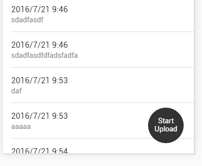

本篇主要记录了我遇到的一些问题，和解决方案，以供参考。问题比较杂乱，简单分了一下类，感觉还是不太清晰π__π，但是感觉也没有人会需要全篇内容吧，如果能在你报了某个错误时，我的某个解决方案能给你一点启发，那就是做好事啦~
<!-- More -->

# APP需求背景简介 #
这个APP的需求简单来说是这样的：
1. 在有网络的环境中打开APP时，从后台下载表单资料(下拉选项等)保存在Device，无网络环境下从Device读取表单资料；
2. 用户填写表单并保存后，信息保存在Device，并且如果网络允许，进行自动上传到后台服务器，如果网络不允许，将等到网络允许时上传；
3. 网络区分WIFI和3G/4G，WIFI下自动上传，3G/4G下如果用户选了Allow 3G，就自动上传，否则当用户点击上传时才上传，并且开始上传后用户可以点击停止以终止上传。
4. 填写表单时，用户可以添加手机图库的图片，也可以拍照

# 方案篇 #
## 照片离线存储、上传： ##
调用图库和拍照都是使用`cordova-plugin-camera`插件，值得一提的时候，这个插件调用图库选图片的时候一次只能选一张，如果想一次选多张可以使用`cordova-imagePicker`插件。他的`CameraOptions`中，把`saveToPhotoAlbum`设为`true`，可以在拍照的时候保存下来图片，默认是`false`。使用camera插件选图或拍照后会得到一个imgURI，是图片的缓存路径，存储的时候存储这个路径，上传的时候从这个路径里上传图片。

照片上传使用这个插件：`$cordovaFileTransfer`
用法文档参考链接：
1. [论坛](https://forum.ionicframework.com/t/cordova-file-transfer-upload-image-from-device/40517)
2. [cordova-plugin-file-transfer github](https://github.com/apache/cordova-plugin-file-transfer)
3. [$cordovaFileTransfer文档](http://ngcordova.com/docs/plugins/fileTransfer/)

## 离线存储技术简介 ##
HTML5中关于离线的API主要分为应用缓存（Appcache）和客户端存储两大块。
 
### 应用缓存（Appcache） ###
应用缓存关键词为manifest，主要是在网页的根html标签中添加manifest属性，属性值为保存着需要缓存资源清单的文件的地址。实例:
```
<!DOCTYPE HTML>
<html manifest="demo.appcache">
</html>
```
关于怎样使用，这个链接讲的非常好：[应用缓存初级使用指南](http://www.html5rocks.com/zh/tutorials/appcache/beginner/)。
需要应用到manifest的场景是——离线网页应用，就是使用前不需要用户下载一个APP或者是别的任何东西，而是访问一个网址，第一次访问时，就把这个网页上需要缓存的东西，例如JS文件、CSS文件、网页中用到的图片、图标等，下载到浏览器，然后即使离线情况下，刷新网页，也还是可以使用。

### 客户端数据存储 ###
分类概览：

- Cookie
- Web Storage
    * localStorage(前身是globalStorage)
    * sessionStorage
- 数据库存储
    * Web SQL Database
    * IndexedDB

| 名称   |  大小    |  过期时间  | 与服务器通信 |
| :------|  :------ |  :-----  |    :------  |
| Cookie |  单域名下总大小4K左右，25个/50个/30个 |  默认关浏览器就过期，设置了过期时间，到过期时间才过期| 每次附在请求头中|
| localStorage |单域名下5M或2.5M |  永久保存在浏览器中，除非手动清除 |  不参与通信  |
| sessionStorage|单域名下5M或2.5M|  保存到浏览器关闭，可以跨越页面刷新而存在  |  不参与通信  |

#### Cookie ####
**缺点**

  1. 容量小，超过容量就被浏览器默默丢掉，你啥都不知道~~(想起囧不懂)~~ ；
  2. 使用起来很不方便，需要封装工具方法；
  3. 每次都会附在请求头中发送，影响请求性能；

由于这些限制，只能保存比较少的信息，且由于用户可以查看和改写cookie，所以不能存储敏感信息。

**使用场景：**
登录时保存密码，以前还用来保存用户进行购物车操作时的信息，现在可以用localStorage代替。

#### localStorage ####
缺点：只能存储字符串。非字符串的数据在存储之前会被转换成字符串
#### sessionStorage ####

1. 缺点只能存储字符串。
2. 绑定于某个服务器会话，所以本地运行时不可用，
3. 存储在 sessionStorage中的数据只能由最初给对象存储数据的页面访问到，所以对多页面应用有限制。

#### Web SQL 和 IndexedDB ####
SQLite本身是一个关系数据库管理系统，HTML5拿来封了一套API以实现客户端数据库存储，就是Web SQL，但由于拿来别人的东西使用，就只能就一些边边角角的标准进行定义，这并不是W3C想要的，于是现在Web SQL已经被废弃，而另起炉灶创建了IndexDB，但由于现在IndexDB的一些功能还停留在草案阶段，所以SQLite还是有一定的市场。

## 使用SQLite的经验 ##
本来项目使用了localStorage来做存储，但后来客户坚持要求使用SQLite，以便未来扩展APP功能时可以对数据进行搜索排序等，于是就重写了相关代码。
**参考教程地址：**

1. [W3C](https://www.w3.org/TR/webdatabase/#executing-sql-statements)
2. [菜鸟网，可以作为API查询](http://www.runoob.com/sqlite/sqlite-drop-table.html)
3. [A Simple TODO list using HTML5 WebDatabases](http://www.html5rocks.com/en/tutorials/webdatabase/todo/#toc-step3)
4. [使用 HTML5 开发离线应用](https://www.ibm.com/developerworks/cn/web/1011_guozb_html5off/)

**评价：**
优点：如果需要数据搜索、排序等，可以使用
缺点：异步操作，操作结果的后续动作需要写在回调函数里，如果需要频繁存取，或者逻辑比较复杂，会产生很复杂的嵌套，不便于维护、并且是已经被废弃的标准

## ionic 点击小图显示大图 ##
1. [ionic click small image show big image](https://devdactic.com/images-videos-fullscreen-ionic/)
2. [Ionic Modal - Fullscreen images](https://codepen.io/rdelafuente/pen/tJrik/)
3. [How To Display Images and Videos with Ionic Really Cool](https://devdactic.com/images-videos-fullscreen-ionic/)

## 判断手机网络状况 ##
[$cordovaNetwork](http://ngcordova.com/docs/plugins/network/)

## 使用$state.go切换状态之前，检查token  ##
[angular ui-router login authentication](http://stackoverflow.com/questions/22537311/angular-ui-router-login-authentication)

## Base64解码 ##
[Base64 编码与解码](http://www.w3cfuns.com/notes/13967/3f397874b7afbe49eaa678f3331bf5e0.html)

## angularJS $Watch元素高度变化 ##
需求背景是，输入框一开始高度是一行，输入多行时高度自适应，达到6行时，固定高度，出滚动条，textarea做不到这些，于是使用了可编辑div做输入框，给div标签加了`contenteditable = true`属性。然后需求就是要监听其高度变化。如果是input输入框就可以用ng-change事件监听，但这个不行要手动写一个。

使用directive，首先想到使用scope.$watch() 监听div的html改变，可是失败了，因为只有当onblur的时候才会触发$watch计算高度改变，而我要的是在输入的时候，随时监听，以在换行时发现高度改变。【失败代码】：
```
.directive('logdirective',function(){ 
    return { 
        link:function(scope, ele, attrs){ 
            scope.$watch(function(){ 
                return ele[0].html; 
                }, function(newVal, oldVal){ 
                console.log('height change!'); 
                console.log(newVal); 
            },true); 
        } 
    } 
});
```

最后不得不使用一个interval来定时检测高度变化，【成功代码】：
```
.directive('logdirective',function($interval){
            return {
                link:function(scope, ele, attrs){
                    var timer = null;
                    var memHeight = ele[0].offsetHeight;

                    ele.on('focus', function(){
                        $interval.cancel(timer);
                        timer = $interval(function(){
                            var oldVal = memHeight,
                                newVal = ele[0].offsetHeight;
                            memHeight = newVal;
                            if(newVal !== oldVal){
                                console.log('height changed!');
                                return;
                            }
                        },1000);

                        timer.then(function(){
                            console.log('timer resolved');
                        }, function(){
                            console.log('timer rejected');
                        });
                    });

                    ele.on('blur', function(){
                        $interval.cancel(timer);
                    });
                }
            }
        });
```


# Error篇

## cordova already defined ##
原因：index页面重复引入了 cordova .js，删除一个就好

## ionic页面滚动时，因为父级使用了transform，导致内容中Position:fixed失效  ##
关键词：ionic scroll fixed
解决方案：[把该元素拿到`<ion-content>`外面](https://forum.ionicframework.com/t/css-position-fixed/2969 '把该元素拿到`<ion-content>`外面')

如果不是在ionic中，其他思路：

1. 去transform滚动，自己写滚动，
ionic 禁止滚动：在`<ion-content>`上添加scroll = false
[angularJS绑定滚动事件](https://segmentfault.com/q/1010000005666477/a-1020000005677694 '这是一个链接')
2. 各种hack方案
[Positions fixed doesn't work when using -webkit-transform](http://stackoverflow.com/questions/2637058/positions-fixed-doesnt-work-when-using-webkit-transform '这是一个链接')
3. 拓展：
[摆脱jquery!angularjs利用指令简单实现滚动翻页](http://www.ddhigh.com/2014/09/angularjs-lazy-load/ '这是一个链接')

## ionic滚动时，ion-content 高度计算错误 ，不能显示全部内容 ##

解决方案：
在ion-content上加上
```
{   position: absolute;
    top: 0;
    left: 0;
    bottom: 0;
    right: 0;
    margin: auto;
}
```
**注意：**top和bottom值必须为零，如果需要间隔，在ion-content的子元素上加margin，而不要修改top值或bottom值，否则会造成高度计算不正确，还是不能正常显示全部内容。

## 上传图片： ##
后台是用ASP.NET接收的，写法参考链接：

1. [Upload image from phonegap app to WCF service](http://stackoverflow.com/questions/17232183/upload-image-from-phonegap-app-to-wcf-service)
2. [Upload image from android phonegap to a server using asmx](http://stackoverflow.com/questions/8643708/upload-image-from-android-phonegap-to-a-server-using-asmx)

### 问题1：不能发出请求 ###
console出来错误是：
```
upload error source 
upload error target
```

以及会Alert:（一次只Alert一个，code=1或者code=3，这两种都遇到过）
```
An error has occurred : code =1  
An error has occurred : code =3
```

code = 1最终解决方案：
原因：传送的文件大小超出服务器接收限度
```
<system.serviceModel> 
  <bindings> 

//其他的setting, 藍色是新增的 

  <webHttpBinding> 

  <binding maxReceivedMessageSize="2147483647" /> 

  </webHttpBinding> 

  </bindings> 
```
这是加在后台的，我也不太懂，后台摸索好久，一开始加的地方不对，据后台说需要加到最外层，才变好了。

**解决方案参考链接：**

1. [Phonegap File Transfer of picture fails on every other picture: Error code 3 with FileTransfer upload](http://stackoverflow.com/questions/19275268/phonegap-file-transfer-of-picture-fails-on-every-other-picture-error-code-3-wit)
2. [File upload error code 1 in ng-cordova filetransfer plugin](http://stackoverflow.com/questions/30783847/file-upload-error-code-1-in-ng-cordova-filetransfer-plugin)
3. [Best way to transfer a picture it to a server](https://forum.ionicframework.com/t/best-way-to-transfer-a-picture-it-to-a-server/53326
https://github.com/dtaalbers/ionic-2-examples/tree/master/file-transfer-uploa)
4. [Problems with image URL when uploading with file transfer plugin(最大长度)](https://forum.ionicframework.com/t/problems-with-image-url-when-uploading-with-file-transfer-plugin/50230)
5. [cordova file transfer文档，code代表的含义](https://cordova.apache.org/docs/en/latest/reference/cordova-plugin-file-transfer/#installation)
6. [Retrieve HTTP headers in Cordova File Transfer ASP Server](http://stackoverflow.com/questions/32862953/retrieve-http-headers-in-cordova-file-transfer-asp-server)

### 上传数据的格式 ###
解决了code=1，后台可以接收到请求之后，后台不知道我传过去的数据是什么格式的，我也不知道，因为从浏览器的network里看不到相关信息，cordova-file-transfer文档里也看不到相关介绍。于是后台那边只能看到一张全黑的图片，他们搞了两天，最后终于找到说安装了一个解析包：`HttpMultipartParser`然后就能正常解析了，并且搞明白了传过去的格式是stream，里面包含了图片数据和uploadOptions里的参数。后台筒子们，我只能帮你们到这了。

### $on('$stateChangeStart')中使用$state.go会导致无限循环的问题 ###
[Ui-Router $state.go inside $on('$stateChangeStart') is cauzing an infinite loop](http://stackoverflow.com/questions/26796945/ui-router-state-go-inside-onstatechangestart-is-cauzing-an-infinite-loop)

### npm install 时的问题 ###
[unmet dependency but will load](https://github.com/vigetlabs/gulp-starter/issues/62)
按照答案中的方法之后会报错：
`'rm' 不是内部或外部命令，也不是可运行的程序 或批处理文件。`
原因：rm是linux中的命令
解决方案：
使用git bash 打开项目文件夹，
rm -rf $HOME/.npm
npm cache clean
然后再回node shell中使用npm install

### npm install的时候，不能自动安装插件，build出来的APK包plugin丢失， ###
是因为在安装cordova插件的时候，本应该使用这样的安装命令`cordova plugin add XXX --save`，但我没有加 `--save`，这个`--save`的作用是会自动保存插件的信息到项目根目录下的config.xml，这样在npm install的时候就会根据config.xml文件来自动安装插件

# 其他 #
## angular 如何刷新页面 ##
需求：多个状态都会跳转到某个state，有一些跳转需要刷新，有一些不需要刷新
解决方案：
全部需要刷新的时候，就在state里加上`cache:false`;
部分需要刷新的时候，使用$rootScope.$broadcast()，把需要刷新的初始化函数放在 $rootScope.$on的回调函数里

## AngularJS定时器 ##
1. [说说Angular中的$timeOut定时器](http://sentsin.com/web/486.html)
2. [AngularJS中$interval的用法详解](http://www.codesec.net/view/406326.html)

## Array的删除splice和for循环合用时的一个小坑  ##
Array的删除splice和for循环合用时，由于Array删除一项之后，影响到length和后面项的索引值，所以一定要注意。正确代码：
```
var i=0; 
for(i; i< arr.length; ){ 
  if(arr[i].isSelected===true){ 
    arr.splice(i,1); 
  }else {i++;} 
}
```
---
参考链接：
1. [详说 Cookie, LocalStorage 与 SessionStorage](http://jerryzou.com/posts/cookie-and-web-storage/)
2. [Why is Web SQL database deprecated?](http://programmers.stackexchange.com/questions/220254/why-is-web-sql-database-deprecated)
3. [Ion-content height:100% is not working](https://forum.ionicframework.com/t/ion-content-height-100-is-not-working/28667/2)